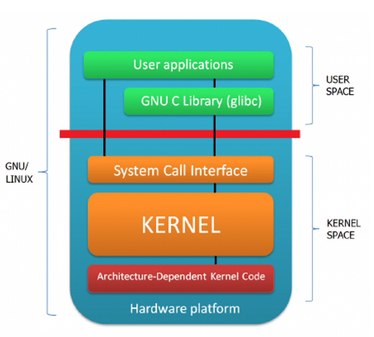

## 1. Operační systém

### 1. Princip

- poskytuje uživateli rozhranní pro práci s počítačem
- abstrahuje hardware
- sleduje stav systémových prostřepků (procesor, paměť) - obsluhuje HW
- organizace úloh pro procesor, ukládání dat, ...
- uživatelské rozhranní, GUI, terminál - userspace
- API (programové celky, které využívá programátor nad OS) - rozhranní pro programování - mezi userspace a OS
- kernel je hlavní správce OS
	- přiděluje úkoly periferiím
	- abstrakce funkcí
	- pomocí driverů (ovladač pro daný kus HW)
	- typy: mikrojádro (minimalistické - většina funkcí OS je zajištěna podpůrnými programy; monolitické - komplexní, Linuxí kernel, modulární; hybridní - kompromis)
- POSIX je standard, jak má OS pracovat a fungovat (windows není POSIX)

### 2. Historie

- jako úplně první děrné štítky, žádný OS
- konec 50. let první náznaky OS, terminály u sálových počítačů
- v 60. letech se začalo kromě děrných štítků využívat magnetických pásek, ty byly rychlejší
- 70. léta UNIX, Multics, VMS
	- nezávislost HW
	- Multics: MIT, sálové počítače, armádní
	- VMS: vyvíjen až do roku 2000
- 80. léta:
	- DOS
	- MacOS: integrace GUI, myš
	- první vývoj open-source: FreeBSD, OpenBSD, NetBSD
- 90. léta:
		- DOS byl koupen společností microsoft
		- vznik celé komunity GNU/Linux, Torvalds - kernel, Stoneman - GNU = userspace - open-source

### 3. Druhy

- **Jednoúlohový-jednouživatelský** - DOS
- **Víceúlohový-jednouživatelský** - Windows (dříve)
- **Víceúlohový-víceuživatelový** - GNU/Linux, MacOS

### 4. Výhody a nevýhody

- více procesů, rychlejší přístup k datům, sdílení souborů, univerzálnost programů, kompatabilita
- bezpečnostní rizika, windows je proprietární
