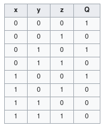
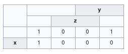

## 10. Logické obvody

### 1. Logická hradla

- základní prvek logických obvodů
- implementace Boolovských funkcí
- typicky jeden či více vstupu, ale jeden výstup
- hradla definujeme pomocí stavové tabulky
- násobení pomocí AND, nebo pomocí OR
- logická funkce je realizovaná pomocí logického členu, zatímco hradlo je konkrétní implementací

### 2. Základní zapojení

- **repeater**: pouze upevňuje napěťovou úroveň
- **invertor**: NOT, invertuje vstup
- **AND**: implementace logického součinu
- **OR**: implementace logického součtu
- **NAND**: negovaný AND, nejčastěji používaný člen v počítačích zejména ve FLASH uložištích
- **NOR**: negovaný OR
- XOR: unikátní hodnota v porovnání s ostatními 
- reálně se log. obvody realizují pomocí aktivních komponent, tranzistory, diod, ...
- často více integrovaných v jednom pouzdře

### 3. Minimalizace

- proces, při kterém se snažíme omezit počet logických členů, optimalizace zapojení
- nejčastěji se používa Karnaughova mapa, jedná se o dvourozměrnou matici, do níž vkládáme jednotlivé pravdivostní hodnoty a poté slučováním tvoříme logické bloky
- zde je názorný příklad:

Takže výsledná funkce vypadá $Q(x,y,z) = \overline{y} \cdot \overline{z} + \overline{x} \cdot \overline{z}$

### 4. Využití v praxi

- čítače
- podpůrné obvody sedmisegmentových displejů
- paměti
- procesory
- vyhodnocovače signálu, PLL
- frekvenční modulátory