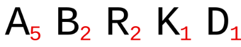
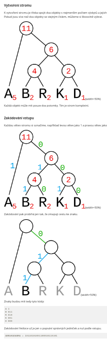
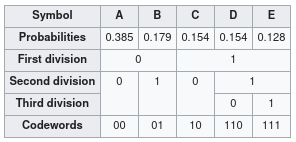

## 12. Kódování znaků

### 1. ASCII

- American Standard Code for Information Interchange
- definuje znaky zejména používané v informatice
- obsahuje sedmibitové znaky, tedy celkom 128 znaků
- 0 - 31 jsou netisknutelné znaky, jsou k řízení datového přenosu, formátování tisku
- spravuje organizace ISO

### 2. Unicode

- konzistentní znaková sada
- reprezentuje se v ní více než 14000 znaků používaných po celém světě
- pokud chceme zakódovat určitý znak do unicodu, použijeme unicode tabulku
	- ale jednoduše latinka začíná 97 - a, a končí 122 - z
	- potom převedeme decimální číslo na hex, takže 97 by bylo 61
	- unicode se zapisuje U+hex, pro nás U+0061
- principy kódování:
	- jednotnost: konstantní šířka dovoluje rychlé hledání, třídění, ...
	- univerzálnost: zahrnuje všechny znaky, které by mohly být použité při výměně textu
	- jednoznačnost
	- maximální využití: není nutná escape sekvence, znak není závislý na jeho kontextu, snadaná zpracovávatelnost strojem

### 3. UTF-8

- unicode transformation format
- jeden ze způsobů kódování, znaky na číselné řetezce
- má proměnnou délku od 1 do 4 bajtů
- vychází ze standardu Unicode
- ostatní, například UTF-16 či UTF-32 mají fixní délku, 16 respektive 32 bitů
- zpětná kompatabilita s ASCII

### 4. Huffmanovo kódování

- bezeztrátová komprese dat
- základní princip spočívá v tom, že se znaky, které se v souboru vyskytují nejčastěji, jsou konvertovány do řetězců s nejkratší délkou, nejfrekventovanější znak může být konvertován do jediného bitu
- komprese probíhá ve dvou krocích, řazení dle četnosti jednotlivého znaku, potom vytvoření binárního stromu
- postup při kódování $ABRAKADABRA$:

### 5. Shannon - Fano kódování

- jedná se o bezeztrátovou kompresi dat
- od Huffmanova kódování se liší konstrukcí binárního stromu
- množina znaků je dělena na dvě, tak aby součet znaků v každé byl připližně stejný
- poté je první přiřazena 0 a druhé 1

