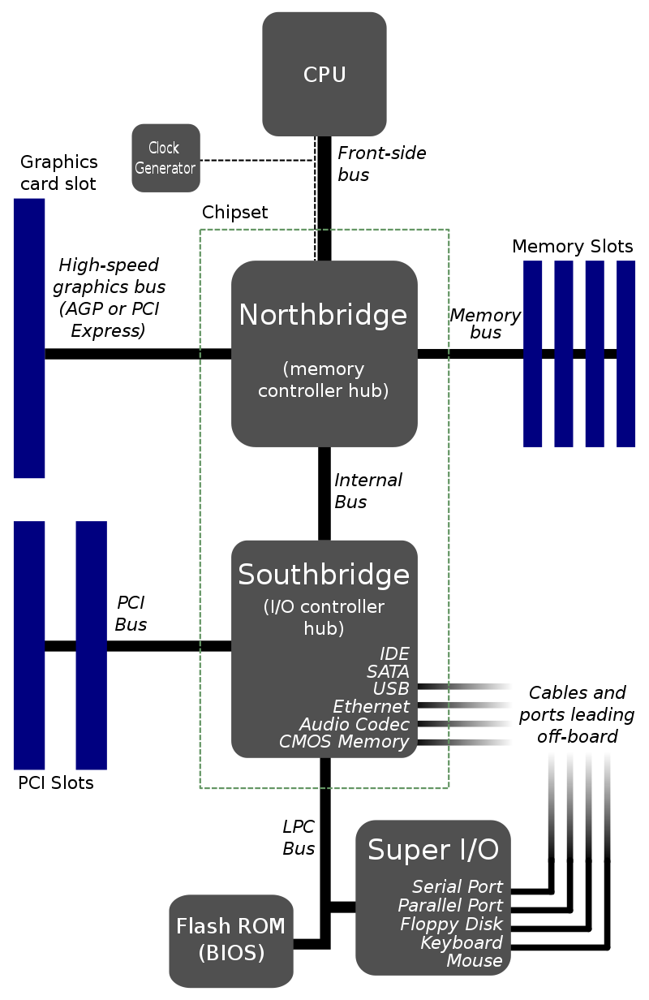

## 13. Architektura počítačových systémů

### 1. Von Neumannovo schéma

- jedná se o označení programovatelného počítače (čte instrukce z paměti, ty zpracovává CPU), jedná se o návaznost teoretického modelu TS
- využívá jedinou sběrnici, na níž jsou připojené všechny komponenty, CPU, MEMORY, PERIFERIE, sběrnici dělíme na kontrolní (posílání zpětné vazby), adresovou (alokace paměti), a datovou
- zpracovává instrukce sekvenčně
- je omezená rychlostí komunikace, dnešní procesory pracují mnohem rychleji, než je přenosová rychlost busu, částečné řešení spočívá v cachi

### 2. Harvardská architektura

- fyzicky odděluje paměť programu a dat a jejich  spojovací obvody
- strojové instrukce jsou uložené na separátní paměti, nejdříve na děrované pásce, a data byla nejdříve uložena na elektromagnetických deskách
- nejčastěji se pro strojovou paměť používala ROM (read only mem) a datovou RWM (read-write mem)
- díky tomuto přístupu se rychlost mnohem zvýšila, počítač implementuje paralelní přístup, může najednou zapisovat a číst z paměti programu
- pro rychlejší přístup k paměti programu se implementuje cache
- používa se v riskových mikrokontrolérech
- díky rozdělené paměti můžeme uplaťnovat sběrnice různé šířky pro specifické účely
- dnešní procesory kombinují přístupy von Neumanna i Harvardských inženýrů
		- uvnitř je architektura Harvardská, na ROMce je instrukční sada, cache se dělí na instrukční a datovou
		- ale zvenku se procesor chová jako CPU z von Neumannovi arch. protože načítá data z hlavní paměti přes jednu sběrnici 

### 3. Komponenty počítače

- jednotlivé komponenty na základovce
- CPU, k němu rychlá operační paměť RAM (Random acces memory), poté velkokapacitní uložiště
- severní můstek má za úkol spravovat RAM a další vysokorychlostní sběrnice
- jižní spravuje BIOS (Basic Input-Output System, ROM, inicializuje komponenty počítače, předpřipraví systém operačnímu systému), PCI sběrnice a další periferie (ethernet, USB, SATA, Audio, ...)

