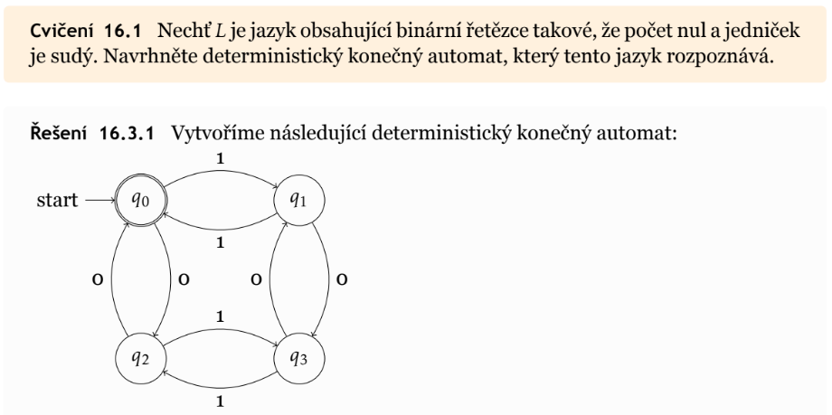

## 17. Konečné automaty

### 1. Definice

- konečný automat, KA, anglicky FSM - final state machine, či DFA - deterministic finite automaton
- teoretický výpočetní model používaný v inf pro práci s formálními jazyky
- množina stavů takového stroje je konečná, od toho konečný
- dokáže pouze rozpoznávat regulární jazyky, proto se používá pouze pro vyhodnocování regulárních výrazů, *lexikální analyzátor* (viz kompilátor) v kompilátorech
- je definovaný jako uspořádaná pětice $(Q, \Sigma, \sigma, \delta, q_0, F )$
	- $Q$ je konečná množina všech stavů automatu
	- $\Sigma$ je vnitřní abeceda automatu
	- $\delta$ je tzv. přechodová funkce popisující pravidla přechodů mezi jednotlivými stavy
	- $q_0 \in Q$ je počáteční stav automatu
	- $F \subseteq Q$ je množina všech koncových stavů
- neformálně řečeno je automat takový stroj, který se na základě aktuálně přečteného symbolu přesune do stavu jiného
- pakliže se po přečtení všech symbolů vstupu nachází automat v některém ze svých koncových stavů, pak daný vstup (řetězec) patří do jazyka $L$, který je rozpoznatelný daným konečným automatem $M$, neboli $L(M)$
	- potom množina všech vstupů, které rozpozná daný automat tvoří jistý regulární jazyk
- rozlišujeme dva základní typy konečných automatů, deterministické a nedeterministické, pakliže je velikost množiny koncových stavů rovna 1, potom se jedná o ten deterministický a naopak
- každý nedeterministický KA lze přepsat do deterministického KA
- dále je zajímavé, že každý deterministický KA zabírá konstatní množství pomocné paměti

### 2. Použití a realizace

- například v lexikálních analyzátorech, kompilátor
- realizovat se například dá například tabulkou přechodů, či planárním grafem
- praktocky pomocí sekvenčních logických obvodů, Mealyho či Moorův klopný obvod

