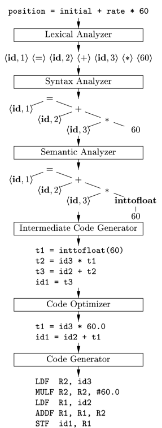

## 18. Kompilátor

- kompilátor slouží pro překlad algoritmů zapsaných ve vyšším programovacím jazyce do jazyka nižšího, nejčastějí strojového (assembly)
- převádí jeden jazyk na jiný
- z matematockého hlediska se jedná o mapovací funkci
- typickým příkladem kompilovaného jazyka je C

### 1. Stavba

- Fáze překladu programu:
	- nejčastějí je zkompilovaný program rozprostřem do několika menších programů, *fragmentace zdrojového kódu*, lepší údržba zdrojového kódu a navíc nižší nároku na kompilátor
	- z tohoto důvodu kompilátor překládá jednotky zdrojového kódu do tzv. *objktového kódu*
	- objektový kód už je vpodstatě strojovým kódem dané architektury, obsahuje dodatečné informace, vazby na externí proměnné či kód
	- z jednotlivě přeložených objektových kódů sestaví linker spustitelný program
	- příklad z jazyka C: program.c $\rightarrow$ program.asm (kompilátor jazyka C), program.asm $\rightarrow$ program.obj (assemler, vytvoření objektového kódu), program.obj + knihovna.lib $\rightarrow$ output (linker; spojení objektů a knihoven do spustitelného kódu)
- často bývají kompilátory rozdělené na dvě části, první je závislá na vstupním jazyce a druhá je závislá na cílové architektuře
- překlad nemusí probíhat přímo, často se generuje tzv. mezikód, kód mezi přechodem z front-endu na back-end
	- dělení kompilátoru na dva menší jednoduché
	- a zároveň jeden mezikód je univerzální mezi architekturami
	- konkrétně v C se mezikód nazývá *přenositelný assembler*
- JIT, just-in-time kompilace, kompiluje se pouze mezikód, tudíž všechny chyby už jsou vyloučeny, byly nalezeny v první části kompilace, přitom mezikód může být interpretován například virtuálním strojem
- překladač může kromě zdrojového kódu dostat i *options*, požadovaná míra optimalizace, povolená syntaxe atd.

### 2. Fungování a význam

- Části překladače:
	- **Lexikální analyzátor**: má za úkol získat ze vstupního kódo tzv. *lexémy* (něco jako klíčová slova - if), všechny lexémy jsou popsány pomocí regulárního jazyka, k jejich rozpokznání se používá konečný automat, do další fáze se kromě lexému posílá identifikátor, u nich se odkazujeme na tabulku identifikátorů, takže se v dalších fází nemuséí pracovat s textem, urychlení překladu
	- **Syntaktický analyzátor**: analyzuje, zda-li je program zapsaný správně kontextově, například po *begin* musí v programu následovat *end*, určuje jak se jednotlivé příkazy budou zpracovávat dále, vyhodnocuje pořadí, využívá se bezkontextové gramatiky, výsledkem je *syntaktický strom*, popisuje strukturu programu
	- **Sémantický analyzátor**: zpracovává syntaktický strom a provádí význam jednotlivých operací, takže syntaktický analyzátor studuje strukturu programu, zatímco sémantický studuje správnost jednotlivých operací, provádí se typová analýza (správné datové typy), dále kontrola pravé a levé strany přiřazovacího příkazu, výstupem je obohacený syntaktický strom
	- **Překladač do mezikódu**: ze syntaktického stromu se stává lineární kód, tzv. *mezikód*
	- **Optimalizátor**: úprava mezikódu, odstranění cyklyckého přižazení či mrtvých větví kódu, kombinace, nahrazení volané funkce jejím obsahem, ...
	- **Generátor kódu**: poslední fáze, kdy se z mezikodu generuje finální spustitelný kód pro danou architekutru, nejčastěji je výstup ve strojovém jazyce

 

### 3. Porovnání s ostatními přístupy

- vedle kompilačního přístupu ještě rozlišujeme přístup interpretační a hybridní
- podle toho se dají rozdělit jazyky na interpretované (Python, Perl), kompilované (C, Go, Rust) a hybridní (Java)
- výhody interpretovaných jazyků:
	- zejména rychlost vývoje, není třeba kompilace
	- laditelnost, není tu optimalizátor, takže není struktura kódu upravována a umožnuje lepší kontolu nad výsledkem
	- kompatabilita, stejný program bude spustitelný na různých architekturách a operačních systémech
	- správa paměti, při interpretaci nemusejí být proměnné vázány na fyzickou adresu v paměti, proto je možné aktivní přemapovávání, zabránění fragmentace paměti
	- obecně je snažší vytvořit interpreter, než kompilátor, lépe se modifikují pro experimentálnější jazyky
- mezi hlavní nevýhody interpretovaných jazyků je výsledná pomalost oproti jazykům zkompilovaným
- interpreter spouští kód přímo, zatímco kompilátor nikoliv, ten pouze konvertuje
- příklady kompilátorů: Javac (jazyk Java, kód je kompilován do bytekódu - to je vpodstatě komprimovaný mezikód, ten je posléze interpretován, takže je hybridní), GNU Compiler Colection (open-source kompilátor, C - gcc, zavolá se kompilítor pro daný jazyk, poté se spustí assembler, linker a vygeneruje se binární spustielný soubor)