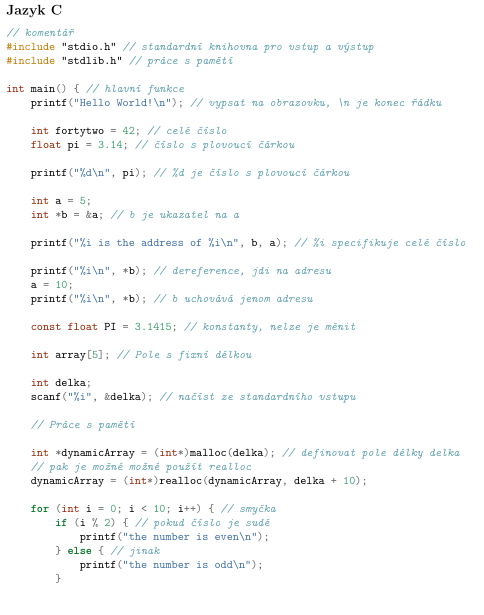

## 4. Imperativní programování

### 1. Algoritmizace

- teoretické řešení určitého problému
- nezáleží na daném paradigmatu, ale imperativní má k algoritmizaci nejblíže
- vlastnosti:
	- elementárnost: jednoduchý soubor kroků
	- konečnost: počet elementárních kroků musí být konečný
	- determinovanost: pro vstupy stejné povahy, shodné výstupy
	- determinismus: každý krok jednoznačně a přesně definován
	- výstup: každý algoritmus musí mít alespoň jeden výstup

### 2. Imperativní paradigma

- popisuje výpočet pomocí přesně definovaného sledu příkazů (imperativ) a určuje tak postup (algoritmus), jak danou úlohu řešit
- Dělení:
	- **Naivní paradigma**: nesystematická syntaxe a sémantika, jazyk BASIC
	- **Nestrukturované paradigma**: velmi blízké assemblerům, lineární sekvence, která je narušována příkazy *GO TO*, což bylo nepraktické, COBOL či FORTRAN
	- **Strukturované paradigma**: vývojové stádium nestrukturovaných, přidané cykly, podmínky a strukturované funkce, vnáření instrukcí, C, Python, Pascal
- základní typy příkazů:
	- přiřazení: operace s informacema uložených v paměti
	- cykly: opakování příkazů několikrát
	- příkazy pro větvení: klasické podmínky, pokud splněno, program se vnoří
- určují, jak se daný problém bude řešit, instrukce za instrukcí, takže popisují *jak*, srovnej s deklarativním přístupem
- funkce vrací hodnotu, zatímco procedura nikoliv
- program je sadou proměnných, jež v závislosti na vyhodnocení podmínek mění pomocí příkazů svůj stav. 
- základní metodou imperativního programování je procedurální programování, tyto termíny bývají proto často zaměňovány.

### 3. Prvky programu

