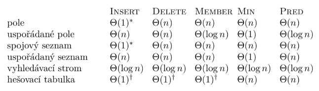

## 6. Datové struktury

- možnost zacházet s množinami vícero způsoby, reprezentace v paměti počítače
- strukturu volíme tedy v závislosti na použití
- liší se rychlostí práce s daty, nebo paměťovou náročností

### 1. Klasifikace

- **Fronta** - LIFO, posloupnost prvků za sebou, *Enque(x), deque* - operace přidání a odebrání z fronty; FIFO, posloupnost, do níž se vkládají a získávají prvky pouze z jednoho konce - first in first out, operce *Push(x), Pop*
- **Prioritní fronta** - implementace fronty s prioritou, takže se nejdříve dostávají prvky s nejvyšší prioritou, operace *Enque(x, p), Deque*
- **Množina** - neuspořádaný soubor dat, operace *Insert(x), Find(x), Delete(x)*
- **Slovník** - podobné množině, akorát ke každému prvku je přiřazen klíč, jedná se o množinu jedinečných dvojic (x, y), operace *Get(x)* - hodnota přiřazená klíči *x*, *Set(x, y)*
- **Uspořádané pole, množiny a slovníky** - výhoda rychlejšího vyhledávání v logaritmickém čase
- **Spojový seznam** - jedná se o seznam, který kromě uložených hodnot, obsahuje refence na další části seznamu, mohou být jednosměrné, či obousměrné (položka odkazuje nejen dál, ale i na předchozí seznam)
- **Halda** - též minimálová binární halda, operace *Insert(x), Min* - nalezne prvek s minimálním klíčem, binární, jelikož každý vrchol má nejvýše dva syny - levý a pravý
	- prvek vkládáme vždy do nejnižšího možného patra stromu, podmínka je, aby syn byl větší než jeho otec, pokud tomu tak není, provedeme *BubbleUp()* $\rightarrow$ minimální prvek má vždy klíč jedna
	- jelikož se halda při operaci *ExtractMin()* znova seřadí, je možné realizovat tzv. heap sort
		- neseřazené prvky budeme vkládat do haldy a potom zpětně vytahovat, ale již seřazené od nejnižšího, časová složitost $\mathcal{O}(n \cdot log(n))$
- **Vyhledávací strom** - binární, každý otec max dva syny, levý je větší než otec a pravý je menší
	- $L(v)$ - levý podstrom vrcholu v
	- $R(v)$ - pravý podstrom vrcholu v
	- pakliže je $||L(v)| - |R(v)|| \leq 1$, strom je vyvážený

